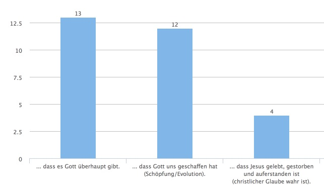

## Grundidee

Einheit, die HK-Leiter direkt im Hauskreis machen können. Handout und Materialien zum einfachen Durchführen im Hauskreis.

## Titel

Die Einheit heisst: "**Glaube und Zweifel – Strategien für ein tragfähiges Glaubensfundament**"

## Umfrage

Umfrage an Hauskreisleiter während der Vorbereitung zum Sammeln der relevaten Fragen. Umfrage ist unter [www.umbuzoo.de/q/fegacademy1](https://www.umbuzoo.de/q/fegacademy1)

### Ergebnisse

Die Umfrage

Thema | Ergebnisse
---------- | -------------
**Grundlagen** | 
**Theologisches** | 
**Persönliches** | 