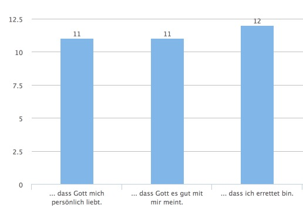

## Grundidee

Einheit, die HK-Leiter direkt im Hauskreis machen können. Handout und Materialien zum einfachen Durchführen im Hauskreis.

## Titel

Die Einheit heisst: "**Glaube und Zweifel – Strategien für ein tragfähiges Glaubensfundament**"

## Umfrage

Die Hauskreisleiter und Teilnehmer konnten an einer Umfrage teilnehmen. Es haben sich 45 Leute beteiligt. Daraus haben sich folgende Schwerpunkte ergeben:

- Existenz Gottes
- Schöpfung
- Theodizee Frage
- Errettung

### Ergebnisse

Alle Eingaben unter: [Glaube_und_Zweifel.xlsx](files/Glaube_und_Zweifel.xlsx)

#### Übersicht

Thema | Ergebniss
---------- | -------------
**Grundlagen** | 
**Theologisches** | 
**Persönliches** | 
